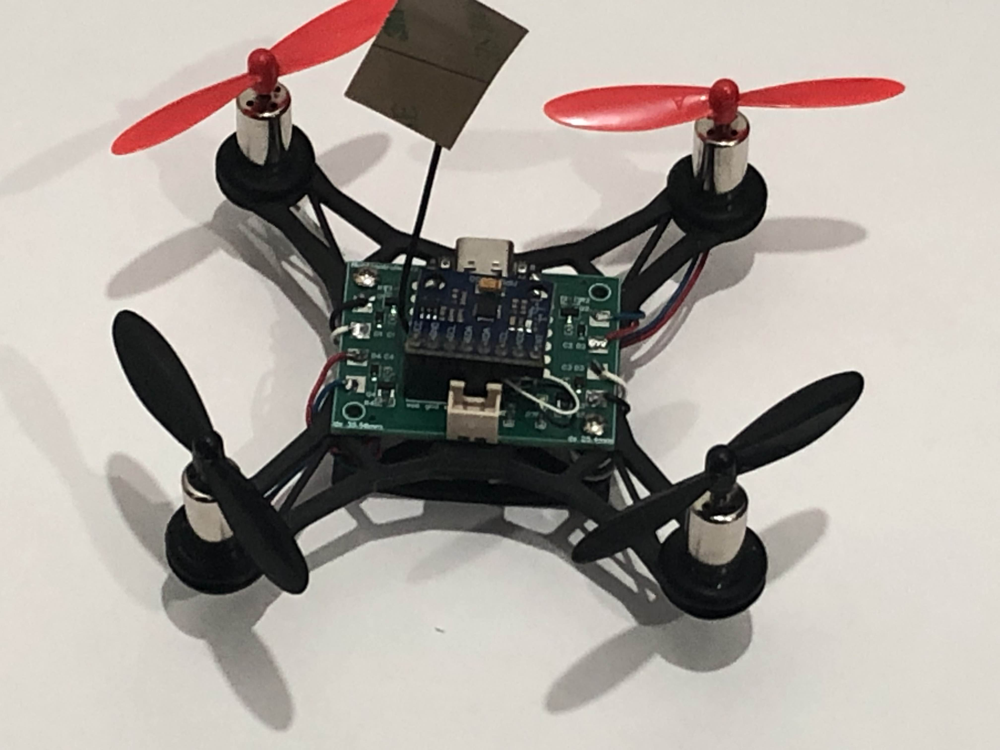
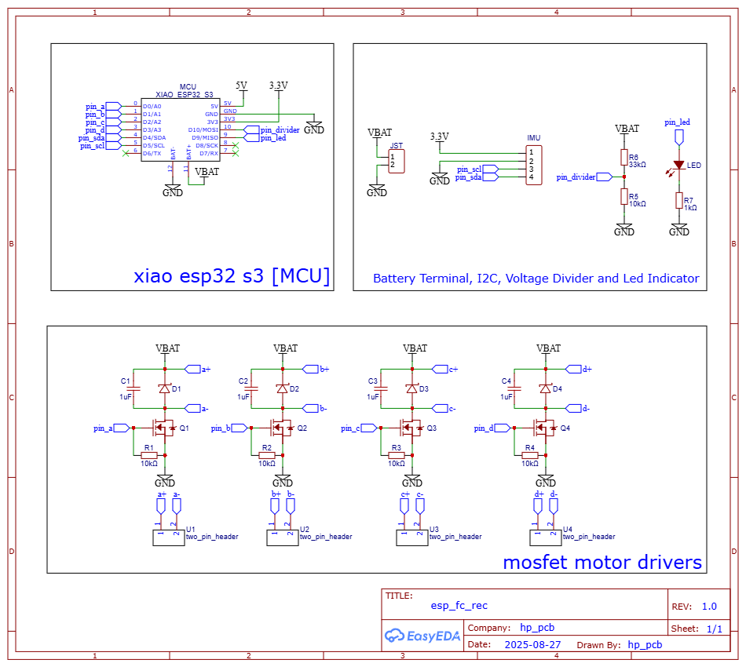
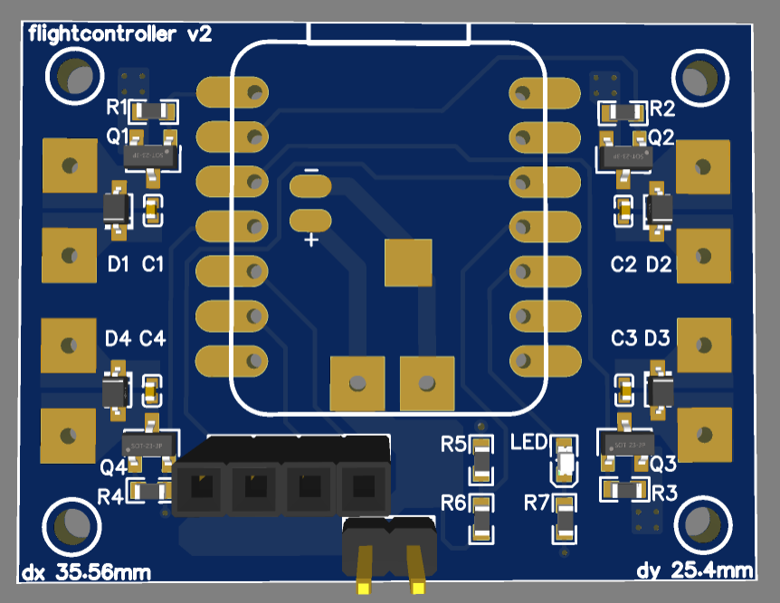

# Micro-Copter

Custom ESP32 based micro quadcopter with fully self designed hardware and firmware for the flight controller.

---

## Overview
Micro-Copter is a compact drone platform built from the ground up, including a custom PCB, low level drivers, and real time flight control firmware. Using the dual core architecture of the ESP32-S3 to separate time critical control from communication and sensing tasks.

---

## Hardware
- Custom designed 2 Layer PCB  
- 4x MOSFET motor drivers 
- Onboard status LED  
- Voltage divider for battery monitoring  
- External MPU6050 as the IMU

### MCU
- ESP32-S3 Dual-core Xtensa LX7 @ 240 MHz  

### Images
PCB layout and schematics:

  
  

---

## Firmware
- Language: C  
- RTOS: FreeRTOS 
- Dual-core task distribution:
  - **Core 0**: PID control loop + motor signal generation  
  - **Core 1**: Sensor reading + wireless communication  

---

## System Architecture

### Sensor Interface
- Protocol: I2C  
- Device: MPU6050 (accelerometer + gyroscope)  
- Custom driver: `mpu6050.c/h`  

### Motor Control
- PWM based control of MOSFET drivers  
- Module: `motor.c/h`  

### Control System
- PID controller for stabilization  
- Kalman filter for sensor fusion  
- Module: `pid.c/h`  

### Wireless Communication
- Protocol: ESP-NOW  
- Receives control inputs from external esp32 transmitter  
- Module: `receiver.c/h`  

### Battery Management
- Monitors battery voltage via ADC (voltage divider) 
- Handles low-voltage conditions (disarm / LED warning)  
- Module: `battery_manager.c/h` *(WIP)*  

---

## Features
- Real time flight control using FreeRTOS  
- Dual core task separation for deterministic control  
- Custom low-level drivers
- Sensor fusion using Kalman filtering  
- Wireless control via ESP NOW protocol 
- Fully custom PCB design  

---

## Interfaces Used
- GPIO  
- PWM  
- I2C  
- Timers  
- Interrupts  

---

## Notes
- Designed for embedded efficiency and deterministic timing  
- Focused on low level control
- Battery management system is still under development  

---

## Future Improvements
- Complete battery management logic  
- Add failsafe mechanisms  
- Improve filtering and tuning of control loops  
- Expand telemetry feedback  
